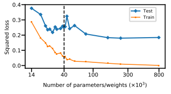
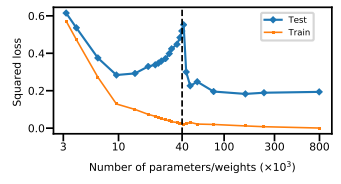
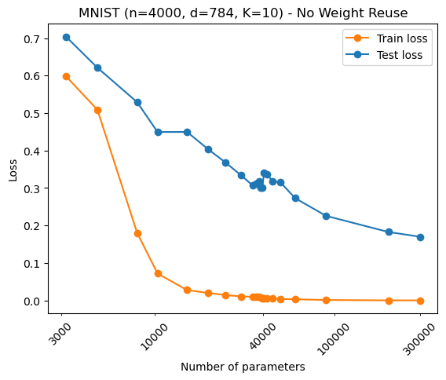
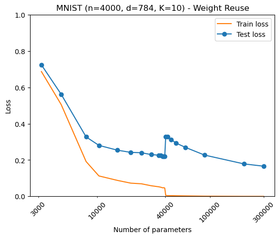

# Reproduction of Belkin et al 2019 (WIP)

<a href="https://www.pnas.org/doi/full/10.1073/pnas.1903070116">Belkin at al 2019</a> [[1]](#1) is a notable paper in the field of machine learning which aims to provide explanation for the observed phenomena of massively overparameterised models providing good generalisation - expanding the U-shaped bias-variance curve of classical theory. Here, I try to replicate their work which showcases double descent on fully connected neural networks trained to identify handwritten digits from MNIST dataset.

## Original Results from Belkin et al [[1]](#1)
|Without weight reuse | With weight reuse |
|:-------------------:|:-----------------:|
|  |  |
|||
## Reproduction
|Without weight reuse | With weight reuse |
|:-------------------:|:-----------------:|
|  |  |

## Comments

In its current state, the results obtained from my testing are quantitively and qualitively different from Belkin et al, as seen in the graphs above. Double descent is still observed, yet it arises as a steep step change at the interpolation threshold, as opposed to the gradual decrease in generalisation seen by Belkin et al [[1]](#1) (particularly obvious with the weight reuse scheme). I also notice little difference between the *weight reuse* and *no weight reuse* settings in the trend of generalisation with respect to number of model parameters.

As of now, it is possible that these differences may be due to a bug or oversight in my implementation. Particularly as <a href="https://github.com/SongweiGe/double-descent-pytorch">another reproduction</a> by <a href="https://github.com/SongweiGe">*SongweiGe*</a> managed to obtain results which more closely resembled Belkin et al [[1]](#1). Further questions arise from lacking details of the original experiment with regards to choice of activation function, learning rate, and batch sizes.

-----

## Setup/Installation

*conda* can be used for easy installation of dependencies:
- Enter 'conda env create -f environment.yml' on the command line (<a href="https://docs.conda.io/en/latest/miniconda.html">conda</a> must be installed) to create a *conda* environment named 'double_descent'
- Navigate to directory containing *belkin_dd_reproduction.py*

If you do not wish to use conda, dependencies can be found in the *environment.yml* file. 

## Running experiments

Training is started from the command line, where a number of options can be specified through arguments. A few significant arguments are listed below (type '*python belkin_dd_reproduction.py -h*' for further information):
- --hidden-units: The number of units in the hidden layer of each model to be trained (e.g. 4 6 10 etc)
- --activation-fun: Activation funtion to be used (sigmoid, relu, none)
- --weight-reuse: Use the weight reuse scheme specified by Belkin et al
- --glorot-init: Initialise networks according to the process defined by <a href="http://proceedings.mlr.press/v9/glorot10a">Glorot and Bengio</a> [[2]](#2)

### Commands for reproducing figures:
**Weight Reuse**:

-Run the following command with varying seeds **i** $\in \{1,2,3,4,5\}$:

'*python belkin_dd_reproduction.py --hidden-units 4 6 10
 13 19 25 31 38 44 46 48 49 50 51 53 57 63 76 113 252 378 --activation-fun relu --weight-reuse --glorot-init --seed **i** --save-metrics*'

**No Weight Reuse**

-Run the following command with varying seeds **i** $\in \{1,2,3,4,5\}$:

'*python belkin_dd_reproduction.py --hidden-units 4 6 10
 13 19 25 31 38 44 46 48 49 50 51 53 57 63 76 113 252 378 --activation-fun relu --seed **i** --save-metrics*'

---
## References
<a id="1">[1]</a>
Belkin, M., Hsu, D., Ma, S. and Mandal, S., 2019. Reconciling modern machine-learning practice and the classical bias–variance trade-off. Proceedings of the National Academy of Sciences, 116(32), pp.15849-15854.

<a id="2">[2]</a>
Glorot, X. and Bengio, Y., 2010, March. Understanding the difficulty of training deep feedforward neural networks. In Proceedings of the thirteenth international conference on artificial intelligence and statistics (pp. 249-256). JMLR Workshop and Conference Proceedings.