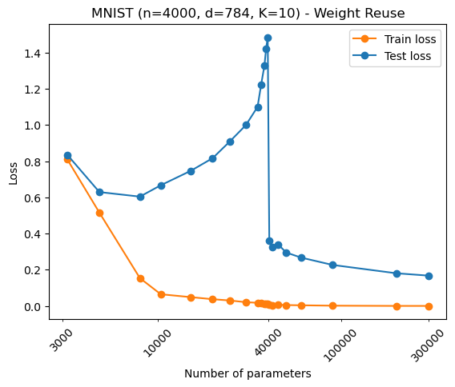

# Reproduction of Belkin et al 2019 (WIP)

<a href="https://www.pnas.org/doi/full/10.1073/pnas.1903070116">Belkin at al 2019</a> [[1]](#1) is a notable paper in the field of machine learning which aims to provide explanation for the observed phenomena of massively overparameterised models providing good generalisation - expanding the U-shaped bias-variance curve of classical theory. Here, I try to replicate their work which showcases double descent on fully connected neural networks trained to identify handwritten digits from MNIST dataset.

## Contents

1. [Original Results](#original_results)
2. [Reproduction Results](#reproduction_results)
    - [Comments](#comments)
3. [Extension](#extension)
    - [Weight reuse scheme](#full_weight_reuse)
4. [Setup](#setup)
5. [Running Experiments](#running_experiments)
    - [Reproducing Figures](#reproducing_figures)
        - [Weight Reuse](#weight_reuse)
        - [No Weight Reuse](#no_weight_reuse)
    - [Experiment Details](#experiment_details)
6. [References](#references)

## Original Results from Belkin et al [[1]](#1)

|Without weight reuse | With weight reuse |
|:-------------------:|:-----------------:|
|  |  |
|||

## Reproduction

|Without weight reuse | With weight reuse |
|:-------------------:|:-----------------:|
|  |  |

## Comments

- Similar qualitative trends to Belkin et al [[1]](#1) seen in both schemes, although there are some differences in magnitude. Peak at interpolation threshold is not as pronounced for the no weight reuse scheme, but is more pronounced for the weight reuse scheme. This is consistent with <a href="https://github.com/SongweiGe/double-descent-pytorch">another reproduction</a> by <a href="https://github.com/SongweiGe">*SongweiGe*</a>.

## Extension

### Addressing the weight reuse scheme

- Reasoning provided by Belkin et al [[1]](#1) for the use of the weight reuse scheme is that stochastic gradient descent (SGD) is sensitive to initialisation. Therefore, they propose that in order to ensure decreasing training risk, larger networks should be initialised with the parameters from the trained previous (smaller) network.
- However, their weight reuse scheme is only applied to models that do not have the ability to interpolate the data (i.e. number of model parameters $<$ number of data points $\times$ number of outputs $= 4000 \times 10$). Reasoning for this is again tied to the idea of decreasing training risk - they note that models above the interpolation threshold should have no issue in reaching zero training risk.
- The remarkable drop in test loss (equivalently, the remarkable increase in generalisation capabilities) at the interpolation threshold is therefore a result of random initialisation. It can be seen that the *weight reuse* graph to the right of the interpolation threshold is similar to the *no weight reuse* graph in the same region.
- To address this somewhat misleading figure, and to further explore the benefit of increasing model complexity the weight reuse scheme is applied to all models in the experiment - even models above the interpolation threshold will be initialised with the previous model's parameters.
- The number of units in the hidden layer increases at a constant rate between each model. This ensures that the same amount of random initialisation occurs at the start of each model training procedure.
- By comparing the 'no_weight_reuse' figure and the results below, we see that the weight reuse scheme is causing each model of greater capacity to be 'locked in' to solutions that generalise poorly. The right-hand side figure below again shows the ability of random initialisation - models initialised with a greater number of new 'free' (randomly initialised) parameters are able to find solutions that generalise well.
- Hence, the trend of generalisation in the weight reuse setting can be manipulated by the size of the model capacity increment.

|Full weight reuse - constant model capacity increment | Full weight reuse - varied model capacity increment |
|:-------------------:|:-----------------:|
|  |  |
|||

-----

## Setup/Installation

*conda* can be used for easy installation of dependencies:
- Enter 'conda env create -f environment.yml' on the command line (<a href="https://docs.conda.io/en/latest/miniconda.html">conda</a> must be installed) to create a *conda* environment named 'double_descent'
- Navigate to directory containing *belkin_dd_reproduction.py*

If you do not wish to use conda, dependencies can be found in the *environment.yml* file. 

## Running experiments

Training is started from the command line, where a number of options can be specified through arguments. A few significant arguments are listed below (type '*python belkin_dd_reproduction.py -h*' for further information):
- --hidden-units: The number of units in the hidden layer of each model to be trained (e.g. 4 6 10 etc)
- --activation-fun: Activation funtion to be used (sigmoid, relu, none)
- --weight-reuse: Use the weight reuse scheme specified by Belkin et al
- --glorot-init: Initialise networks according to the process defined by <a href="http://proceedings.mlr.press/v9/glorot10a">Glorot and Bengio</a> [[2]](#2)

### Commands for reproducing figures

#### Weight Reuse

-Run the following command with varying seeds **i** $\in \{1,2,3,4,5\}$:

'*python belkin_dd_reproduction.py --hidden-units 4 6 10
 13 19 25 31 38 44 46 48 49 50 51 53 57 63 76 113 252 378 --activation-fun relu --weight-reuse --glorot-init --seed **i** --save-metrics*'

#### No Weight Reuse

-Run the following command with varying seeds **i** $\in \{1,2,3,4,5\}$:

'*python belkin_dd_reproduction.py --hidden-units 4 6 10
 13 19 25 31 38 44 46 48 49 50 51 53 57 63 76 113 252 378 --activation-fun relu --seed **i** --save-metrics*'

### Experiment Details

Details of implementation:

- base learning rate: 0.001*
- training batch size: 4000*
- number of epochs: 6000
- activation functions: ReLU*

*Not defined by Belkin et al [[1]](#1), hence chosen.

## References

<a id="1">[1]</a>
Belkin, M., Hsu, D., Ma, S. and Mandal, S., 2019. Reconciling modern machine-learning practice and the classical bias–variance trade-off. Proceedings of the National Academy of Sciences, 116(32), pp.15849-15854.

<a id="2">[2]</a>
Glorot, X. and Bengio, Y., 2010, March. Understanding the difficulty of training deep feedforward neural networks. In Proceedings of the thirteenth international conference on artificial intelligence and statistics (pp. 249-256). JMLR Workshop and Conference Proceedings.